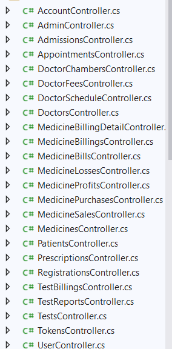
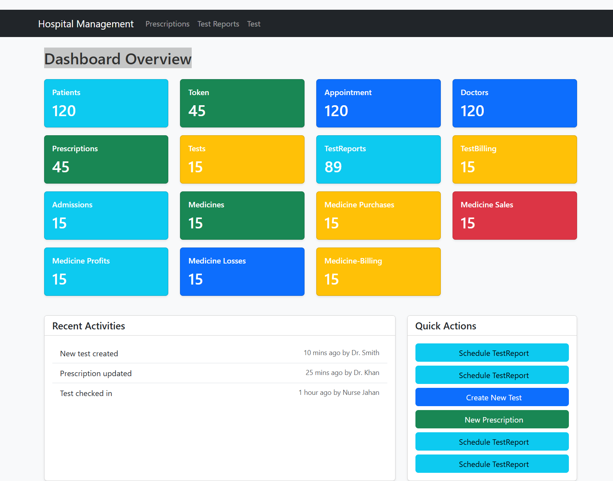
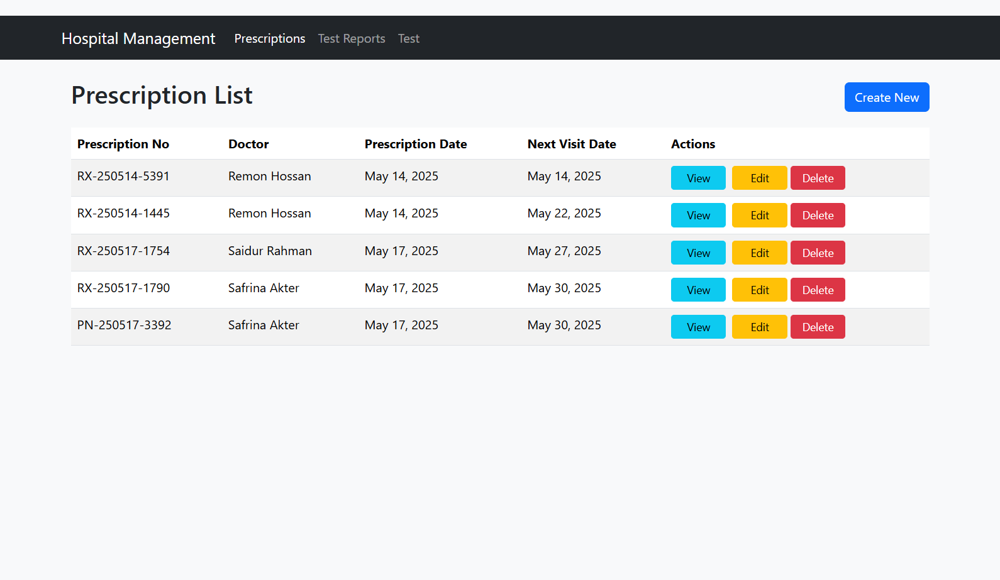
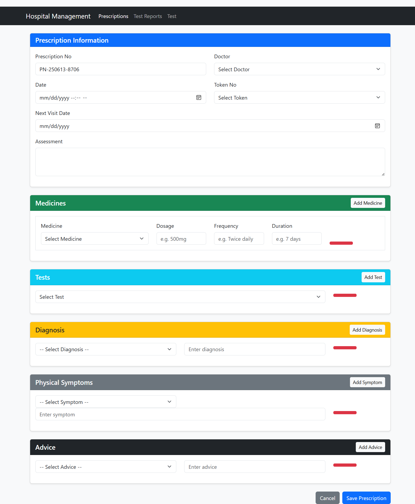
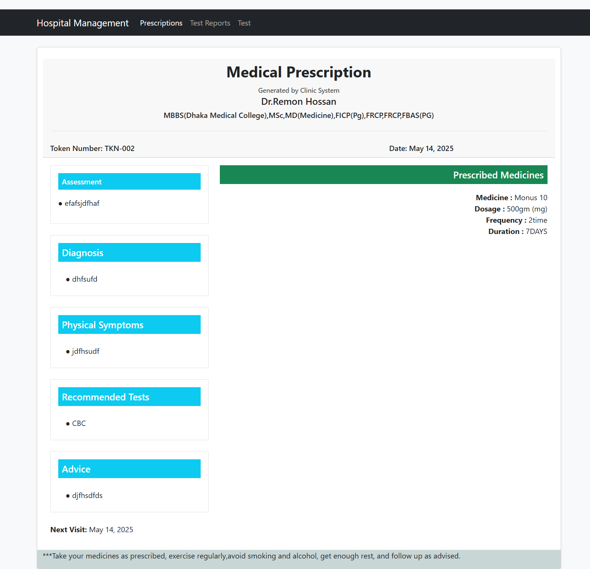
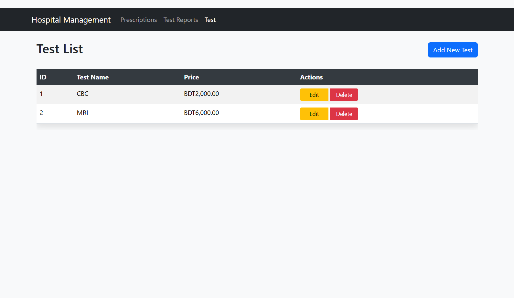
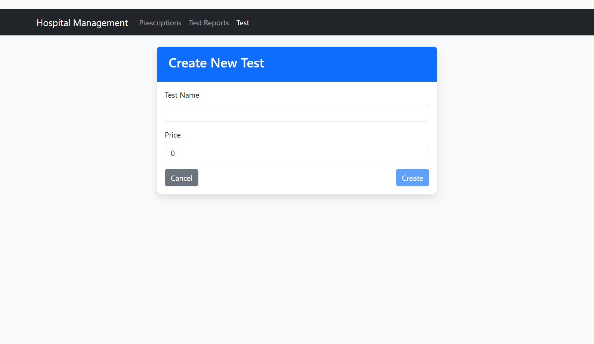
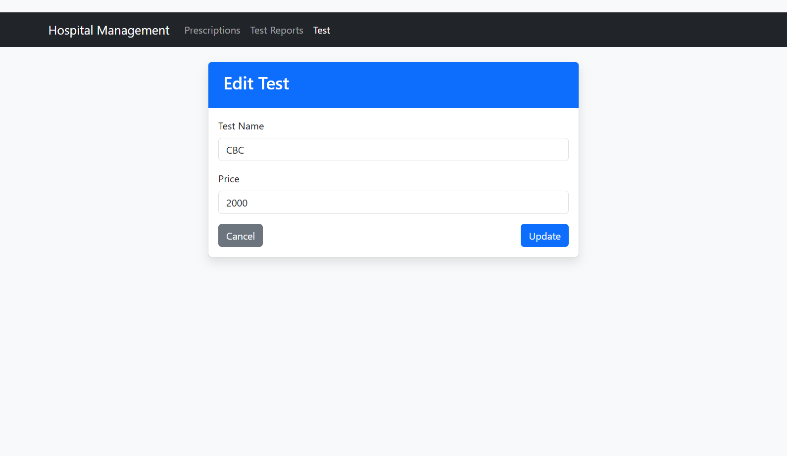
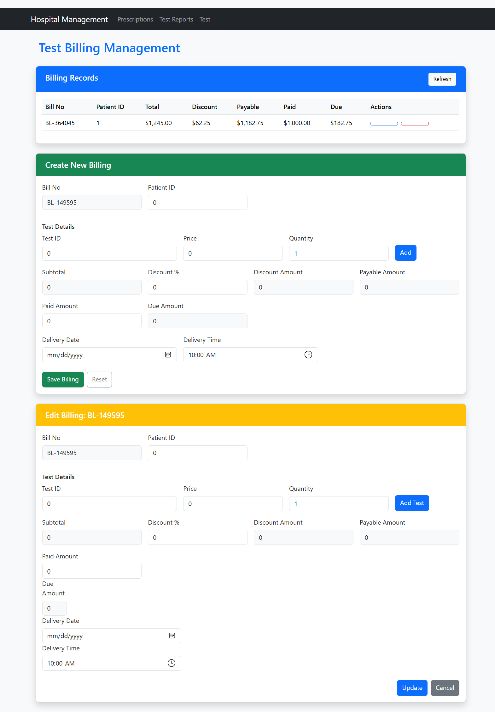
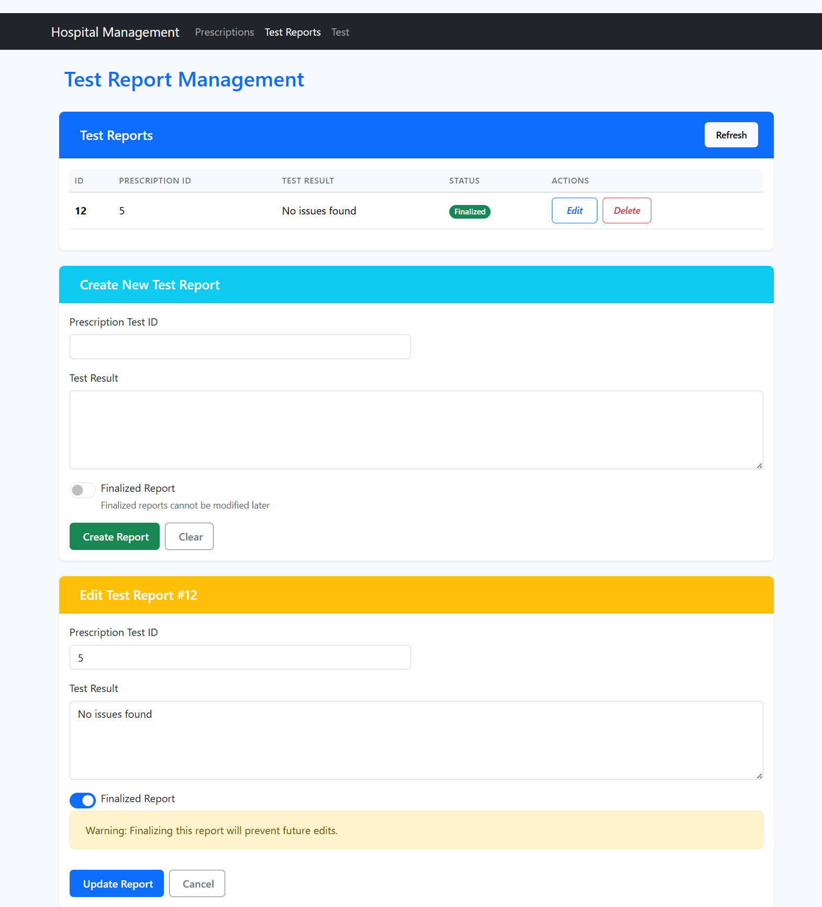

# Hospital Management System – Group Project

## Overview

This is a comprehensive Hospital Management System developed as a group project using **ASP.NET Core Web API**, **Angular**, and **SQL Server**. The system supports various hospital operations including Patient Registration, Appointments, Prescriptions, Test Management, Billing, and more.

Our goal was to build a real-world, scalable solution that automates hospital operations, improves patient care, and supports administrative workflows.

---

## My Contributions (Safrina Akter)

1. Designed and maintained the complete **SQL Server** database schema and relationships
2. Developed and implemented the following core modules:

- **📝 Prescription Management**

  - Developed full CRUD functionality using Angular 18+ standalone components.
  - Integrated dynamic dropdowns for Doctor, Token Number, and Medicines.
  - Implemented separate Create and Edit pages with form validation.

- **🧪 Test Management**

  - Built functionalities for creating, updating, and deleting tests.
  - Handled relational data using dropdowns and maintained referential integrity.

- **💳 Test Billing**

  - Implemented dynamic billing calculations based on selected tests.
  - Designed CRUD operations with a clean master-detail layout.

- **📄 Test Report Generation**
  - Implemented report finalization logic to prevent further edits once finalized.
  - Developed Angular components for listing, creating, and updating test reports.
  - Planned: Bulk test report generation via Prescription Number (partially implemented).

➡️ All these modules were developed using **ASP.NET Core Web API** (backend) and **Angular 19 standalone components** (frontend), styled using **Bootstrap**.

---

## 🧾 Backend Controller Structure

All group members contributed to the **Outdoor Department** modules. Below is a list of Web API controllers used:



> 🧑‍🤝‍🧑 Outdoor section was developed collaboratively. My personal modules include:
> `PrescriptionsController.cs`, `TestsController.cs`, `TestReportsController.cs`, `TestBillingsController.cs`, and SQL database schema.

---

## 💻 Technologies Used

- ASP.NET Core Web API (v8)
- Entity Framework Core (Code First)
- Angular 19 (Standalone Components)
- SQL Server 2022
- Bootstrap 5
- Git & GitHub

---

## 📸 Module Screenshots

### 📋 DashBoard



### 📋 Prescription List Page



### ➕ Create Prescription



### ➕ Prescription Detail View



### 🧪 Test List



### 🧪 Create Test



### 🧪 Edit Test & Test Price



### 💳 Test Billing Management



### 📄 Test Report Generation



---

## How to Run

### Backend

```bash
cd HMSProjectOfMine
dotnet ef database update
dotnet run
```

### Frontend

```bash
cd HospitalManagement
npm install
ng serve
```

---

## Team Credit

This project was built in collaboration with my batchmates as a team project.  
**Each member contributed to separate modules** within the outdoor department, ensuring modular, clean, and testable architecture.

---

## Disclaimer

> This repository is for learning and demonstration purposes only.  
> All contributions listed under “My Contributions” were individually developed by me (Safrina Akter).

---

## Planned Improvements

> **Enhancement Suggestion:**  
> In both the **Test Report** and **Test Billing** modules, `TestId` is currently used for selecting tests.  
> Replacing this with a dropdown that displays the corresponding `Test Name` would enhance user experience and clarity.  
> This improvement is scheduled for a future update.
